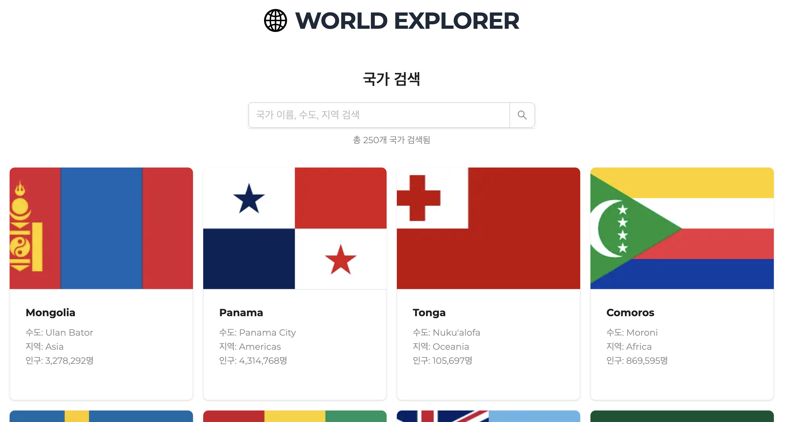

# WORLD EXPLORER APP

이 프로젝트는 국가 정보를 검색하고, 각 국가의 정보를 확인할 수 있는 애플리케이션입니다.

👉 [DEMO](https://world-explorer-app-ochre.vercel.app/)



## 주요 기능

- 국가 이름, 수도, 지역, 언어 등 다양한 필드로 검색 가능
- Debounce 적용된 검색창으로 쾌적한 사용자 경험 제공
- 무한 스크롤로 데이터를 배치 단위로 불러와 성능 최적화
- 서버 측 데이터 패칭 시 캐싱 전략 적용으로 빠른 응답 및 효율적인 리소스 관리
- 국가 상세 페이지 제공 (국기, 인구, 수도, 통화 등 정보 표시)

## 사용 기술

- React 19
- Next.js 15 (app router)
- TypeScript
- Ant Design UI
- Lodash (debounce)
- Intersection Observer API (무한 스크롤)

## 폴더 및 파일 구조

```bash
world-explorer-app
├── app
│   ├── country
│   │   └── [cca]
│   │       └── page.tsx          // 개별 국가 상세 페이지
│   └── page.tsx                  // 홈 (국가 검색)
│
├── components
│   ├── CountryCard.tsx           // 카드
│   ├── CountryDetail.tsx         // 상세 정보
│   └── CountrySearch.tsx         // 검색창
│
├── libs
│   └── fetchCountries.ts         // 데이터 요청 함수
│
├── types
│   └── country.ts                // Country 타입 정의
│
├── public
└── ...
```

## 설치 및 실행 방법

### 1. 프로젝트 클론

```bash
git clone https://github.com/fromnowwon/world-explorer-app.git
```

### 2. 디렉토리 이동

```bash
cd world-explorer-app
```

### 3. 패키지 설치

```bash
yarn install
```

### 4. 개발 서버 실행

```bash
yarn dev
```

## 사용법

- 검색창에 국가 이름, 수도, 지역 등의 키워드를 입력하세요.
- 결과 목록이 자동으로 필터링되고, 아래로 스크롤하면 추가 데이터가 로드됩니다.
- 각 국가 카드를 클릭하면 상세 페이지로 이동합니다.
